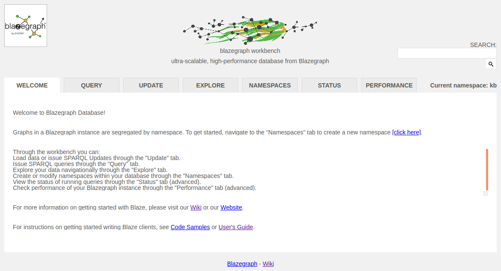

# Установка и запуск Blazegraph

В статье рассматривается как установить графовую СУБД Blazegraph в среде Ubuntu Linux 18.04 LTS.
Часть информации также будет актуальна и для других вариантов Linux.
Рассматриваемая версия Blazegraph 2.1.6.

Как обычно, главная страница продукта содержит ссылки на различные ресурсы, относящиеся к
[Blazegraph](https://blazegraph.com/), одним из которых является
[Wiki на GitHub](https://github.com/blazegraph/database/wiki/Main_Page),
где есть некоторые сведения по установке и запуску этой СУБД.

## Установка

Blazegraph написана на Java и нуждается в Java, начиная с 9-й версии. Вероятно у вас уже установлена Java,
но имеется ненулевая вероятность, что это Java 8. На момент написания этой статьи более новой версией
в Ubuntu 18.04 LTS была 11. Установим её:

``` sh
sudo apt install openjdk-11-jdk
```

Разработчик предоставляет несколько сборок Blazegraph, но не предоставляет собственного репозитория пакетов,
и предлагает нам загрузить подходящий вариант по ссылке <https://github.com/blazegraph/database/releases>.
В нашем случае нам подойдёт пакет формата `deb`. Скачаем его и установим:

``` sh
sudo dpkg -i blazegraph.deb
```

## Запуск

Запуск в Ubuntu Linux:

``` sh
sudo systemctl start blazegraph
```

Проверим успешность запуска:

``` sh
systemctl status blazegraph
```

Если запуск завершился с ошибкой, а именно, скрипт запуска не обнаружил Java,
то откройте настройку сервиса Blazegraph для редактирования:

``` sh
sudo systemctl edit blazegraph
```

И добавьте следующие строки:

``` ini
[Service]

Environment="JAVA_HOME=/usr/lib/jvm/java-11-openjdk-amd64"
```

Убедитесь, что настройки успешно сохранены:

``` sh
systemctl cat blazegraph
```

По-умолчанию устанавливаемые в Ubuntu Linux сервисы при перезагрузке автоматически не запускаются.
Для обеспечения этого выполним команду:

``` sh
sudo systemctl enable blazegraph
```

Если же вы хотите отключить такой запуск, то наоборот вызовите команду:

``` sh
sudo systemctl disable blazegraph
```

Проверим статус доступа по HTTP:

``` sh
http http://localhost:9999
```

(`http` это утилита `httpie`, её можно установить из репозитория Ubuntu Linux или Python.)

Должны получить навроде следующего:

``` plain
HTTP/1.1 301 Moved Permanently
Content-Length: 0
Location: http://localhost:9999/blazegraph/
Server: Jetty(9.4.12.v20180830)
X-Frame-Options: SAMEORIGIN
```

Открыв ссылку <http://localhost:9999/blazegraph/> в браузере вы увидете вот такой интерфейс:


## Ссылки

- Blazegraph: <https://blazegraph.com/>
- Blazegraph GitHub: <https://github.com/blazegraph/database>
- Blazegraph Wiki: <https://github.com/blazegraph/database/wiki/Main_Page>
- Blazegraph Releases: <https://github.com/blazegraph/database/releases>

---

(c) Симоненко Евгений, 2020
