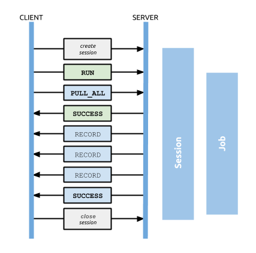
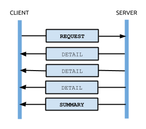

# Протокол Bolt, версия 1

_Перевод спецификации ["Bolt Protocol, Version 1"](https://boltprotocol.org/v1/),
выполненный Симоненко Евгением [easimonenko@mail.ru](mailto:easimonenko@mail.ru)._

_Примечание._ Байтовые значения в этом документе приводятся в шестнадцатиричном
представлении, если только не указано иное.

_Примечание._ Целые значения и значения с плавающей точкой передаются и хранятся
с использованием порядка от старшего к младшему (big-endian), если только не
указано иное.

## Обзор

Этот раздел описывает протокол Bolt версии 1.

Протокол Bolt является клиент-серверным протоколом, где происходит обмен
сообщениями между клиентом, который управляет взаимодействием, и сервером,
который их обрабатывает и отвечает на запросы клиентов. Каждый обмен сообщениями
инициируется клиентом одним или более сообщениями запроса; в свою очередь, эти
запросы принимаются сервером и возвращаются соответствующие ответные сообщения.

На приведённой ниже диаграмме показано типичное взаимодействие, включая порядок
отправленных сообщений и линии жизни сеанса и работы (которые более подробно
описаны в других главах).



Начиная с версии 1, каждому выпуску Bolt присваивается уникальный целый номер
версии. Это число и связанная с ним спецификация относятся к каждому аспекту
протокола, за исключением рукопожатия, которое не версионируется. Авторы
драйверов должны учитывать, что последующие версии протокола, скорее всего,
несовместимы и, за исключением рукопожатия, не гарантируют, что любой
транспортный или сериализационный код может использоваться для разных версий.

Протокол делится на два уровня: транспортный уровень Bolt и уровень сообщений.

## Транспортный уровень Bolt

Для отправки и получения сообщений протокол поддерживает как стандартные сокеты,
так и транспортные уровни WebSocket. Транспортный уровень версионируется вместе
с остальной частью протокола Bolt и отвечает за:

- Согласование версии протокола Bolt.
- Установление и завершение сеанса.
- Маршрутизация сообщений от клиентов к соответствующим сеансам и обратно.

### Сеансы

Каждое подключение к серверу создает новый сеанс, который существует до тех пор,
пока это соединение не будет закрыто. Каждый сеанс изолирован и сервер
отслеживает текущее состояние, основываясь на обмене запросами и ответами в
рамках этого сеанса.

### Соединение

Чтобы начать новый сеанс, клиент подключается с помощью обычного сокета или
WebSocket. После подключения оба транспортных слоя могут обрабатываться
одинаково.

Если сервер был настроен на включение шифрования, TLS, соединения должны быть
выполнены с использованием безопасного сокета или безопасного WebSocket.

Подключение к обычному сокету должно быть сделано к хосту и порту, на которые
был настроен слушатель обычного сокета сервера. Порт по умолчанию для
подключения к обычным сокетам **7687**.

_Важно._ Если TLS включен и сертификат не был указан, то сервер должен
автоматически сгенерировать самозаверенный сертификат TLS. Очень важно, чтобы
ваш драйвер базы данных не просто принимал сертификат без его проверки. Если вы
не проверяете сертификат, то очень просто обойти шифрование. Вы должны либо
убедиться, что у вас есть действующий подписанный сертификат, установленный на
сервере, либо что ваше приложение реализует доверие при первом использовании.

### Рукопожатие

После подключения выполняется рукопожатие для установления, какая версия
протокола Bolt должна использоваться для этого соединения. Это рукопожатие
представляет собой независимый от версии мини-протокол, который, как
гарантируется, останется прежним, независимо от предпочтительных или доступных
версий протокола.

При рукопожатии клиент сперва посылает магическую четырехбайтную преамбулу
(`6060 B017`), за которой следуют четыре версии протокола, которые он
поддерживает, в порядке предпочтения. Предложение всегда представлено в виде
четырех 32-разрядных целых чисел без знака. Каждое целое число представляет
собой предлагаемую для использования версию протокола, или ноль (`00 00 00 00`),
если не нужно (none).

#### Начальное рукопожатие

``` plain
Client: <connect>
Client: 60 60 B0 17
Client: 00 00 00 01  00 00 00 00  00 00 00 00  00 00 00 00
      #  Version 1      None         None         None

Server: 00 00 00 01
      #   Choose
      #  version 1
```

#### Нет поддерживаемой версии

``` plain
Client: <connect>
Client: 60 60 B0 17
Client: 00 00 00 06  00 00 00 00  00 00 00 00  00 00 00 00
      #   Version 6      None         None         None

Server: 00 00 00 00
      #    None
      #  supported

Server: <disconnect>
```

### Кодирование передачи сообщений

Bolt кодирует каждое сообщение с использованием кодирования с фрагментированной
передачей. Каждое сообщение передается как один или несколько фрагментов данных.
Каждый фрагмент начинается с двухбайтового заголовка, беззнакового 16-битного
целочисленного числа, представляющего размер фрагмента, не включая заголовок.
Сообщение может быть разделено на несколько фрагментов, позволяя клиенту и
серверу передавать большие сообщения без необходимости заранее определять длину
всего сообщения.

Каждое сообщение заканчивается двумя байтами со значением `00 00`, которые не
учитываются в отношении длины блока.

#### Сообщение в одном фрагменте

``` plain
Chunk size: 16
Message data: 00 01 02 03  04 05 06 07  08 09 0A 0B  0C 0D 0E 0F

00 10  00 01 02 03  04 05 06 07  08 09 0A 0B  0C 0D 0E 0F  00 00
chunk  |                    Message                     |   End
header |                     Data                       |  Marker
```

#### Сообщение, разбитое на два фрагмента

``` plain
Chunk size: 16
Message data: 00 01 02 03  04 05 06 07  08 09 0A 0B  0C 0D 0E 0F  01 02 03 04

00 10  00 01 02 03  04 05 06 07  08 09 0A 0B  0C 0D 0E 0F  00 04  01 02 03 04  00 00
chunk1 |                    Message                     |  chunk2 | Message |   End
header |                     Data                       |  header |  Data   |  Marker
```

#### Два сообщения

``` plain
Chunk size: 16
Message 1 data: 00 01 02 03  04 05 06 07  08 09 0A 0B  0C  0D 0E 0F
Message 2 data: 0F 0E 0D 0C  0B 0A 09 08

00 10  00 01 02 03  04 05 06 07  08 09 0A 0B  0C 0D 0E 0F  00 00
chunk  |                   Message 1                    |   End
header |                     Data                       |  Marker

00 08  0F 0E 0D 0C  0B 0A 09 08  00 00
chunk  |       Message 2      |   End
header |         Data         |  Marker
```

### Отсоединение

Сеанс завершается, когда закрывается её коммуникационный сокет. Как правило, он
закрывается клиентом.

## Уровень обмена сообщениями

В этом разделе обсуждается семантическое значение и компоновка сообщений
протокола. Подробнее о том, как типы баз данных представлены в двоичной форме,
см. в разделе "Сериализация сообщений".

Клиенты могут отправлять сообщения запроса в любое время после инициализации
сеанса. Клиенты могут отправлять запросы, отправляя одновременно несколько
запросов.

Серверы должны полностью отвечать на каждый запрос до обработки следующего
запроса, а обработка запросов в сеансе должна выполняться в том же порядке, в
котором поступают запросы.

Серверы должны игнорировать сообщения, отправленные клиентом после сбоя на
сервере, пока клиент не подтвердит отказ. См. разделы "Отказ" и "Подтверждение".

Для каждого отправленного запроса клиенты должны ожидать получения нуля или
более подробных сообщений, за которыми следует ровно одно сводное сообщение.
Подробные сообщения доставляют ответный контент, а итоговое сообщение обозначает
конец ответа и любые метаданные ответа. Обратите внимание, что «детальный» и
«сводный» -- это классификации сообщений, а не конкретные типы сообщений.
Например, сообщения `RECORD` классифицируются как подробные сообщения, а
сообщения `SUCCESS` как сводные сообщения.

На приведенной ниже диаграмме показан базовый обмен, в котором клиент отправляет
сообщение запроса и получает серию ответных сообщений.



...

***

Лицензировано под
[Creative Commons 3.0 Attribution-ShareAlike](https://creativecommons.org/licenses/by-sa/3.0/).

Первоначальное авторство [Neo Technology, Inc.](https://neo4j.com/) с
изменениями исходного текста для публикации и ясности.
