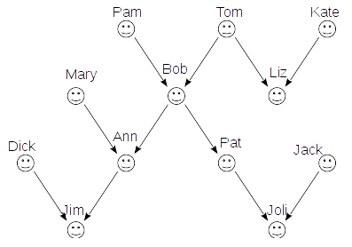
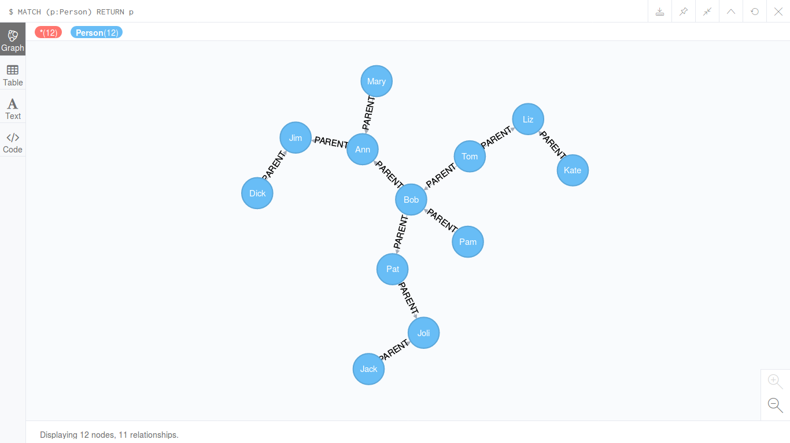
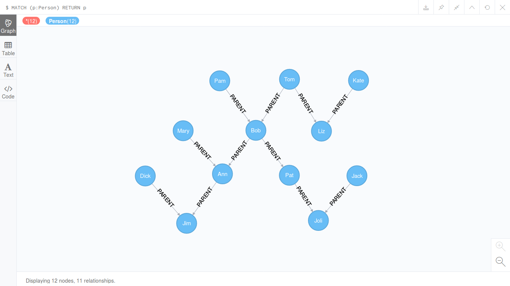
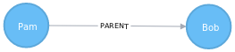

# Введение в язык запросов Cypher

Язык запросов _Cypher_ изначально разработан специально для графовой СУБД
[Neo4j](https://neo4j.com/). Целью Cypher является предоставить интуитивно
понятный, человеко читаемый язык запросов к графовым базам данных. На сегодня
Cypher поддерживается несколькими графовыми СУБД. Для стандартизации Cypher была
создана организация [openCypher](http://www.opencypher.org/).

Основы работы с СУБД Neo4j описаны в статье
[Основы работы с Neo4j в браузере](./neo4j-basics-with-browser.md), а как
установить и запустить в статье
[Установка и запуск Neo4j](./neo4j-install-and-run.md).

Для знакомства с Cypher рассмотрим пример из классического учебника по Прологу
за авторством И. Братко.

Итак, пусть мы имеем генеалогическое дерево, представленное на картинке ниже.



На Prolog это дерево можно задать так:

``` prolog
parent('Pam', 'Bob').
parent('Tom', 'Bob').
parent('Tom', 'Liz').
parent('Kate', 'Liz').
parent('Bob', 'Ann').
parent('Mary', 'Ann').
parent('Bob', 'Pat').
parent('Dick', 'Jim').
parent('Ann', 'Jim').
parent('Jack', 'Joli').
parent('Pat', 'Joli').
```

Посмотрим как сформировать соответствующий граф на языке Cypher:

``` cypher
CREATE (pam:Person {name: "Pam"}),
  (tom:Person {name: "Tom"}),
  (kate:Person {name: "Kate"}),
  (mary:Person {name: "Mary"}),
  (bob:Person {name: "Bob"}),
  (liz:Person {name: "Liz"}),
  (dick:Person {name: "Dick"}),
  (ann:Person {name: "Ann"}),
  (pat:Person {name: "Pat"}),
  (jack:Person {name: "Jack"}),
  (jim:Person {name: "Jim"}),
  (joli:Person {name: "Joli"}),
  (pam)-[:PARENT]->(bob),
  (tom)-[:PARENT]->(bob),
  (tom)-[:PARENT]->(liz),
  (kate)-[:PARENT]->(liz),
  (mary)-[:PARENT]->(ann),
  (bob)-[:PARENT]->(ann),
  (bob)-[:PARENT]->(pat),
  (dick)-[:PARENT]->(jim),
  (ann)-[:PARENT]->(jim),
  (pat)-[:PARENT]->(joli),
  (jack)-[:PARENT]->(joli)
```

Получилось несколько многословней, чем на Prolog, однако и структура узлов здесь
сложней. На Prolog мы также могли наших персон представить в виде такой же
точно структуры, но здесь мы изучаем не Prolog, поэтому оставим это.
Хочу также заметить, что синтаксис Prolog традиционно у многих вызывает
затруднение в понимании смысла записи `parent`, и новичкам нужно объяснять, что
запись `parent('Pam', 'Bob').` следует читать, как "`Pam` is `parent` of `Bob`",
или по русски "`Pam` -- `родитель` для `Bob`'а". Синтаксис связи на Cypher на
мой взгляд очевидней.

Итак, Neo4j нам сообщил, что
`Added 12 labels, created 12 nodes, set 12 properties, created 11 relationships, completed after 9 ms.`
Посмотрим, что у нас получилось:

``` cypher
MATCH (p:Person) RETURN p
```



Никто не запрещает нам отредактировать внешний вид получившегося графа:



## Задаём вопросы

(Здесь также будем рассматривать возможности Cypher, попутно сравнивая его с
Prolog.)

Что с этим можно делать? Можно убедиться в том, что, например, Pam является
родителем Bob'а. Но Prolog мы бы это записали просто:

``` prolog
parent('Pam','Bob').
```

На Cypher так:

``` cypher
MATCH ans = (:Person {name: "Pam"})-[:PARENT]->(:Person {name: "Bob"}) RETURN ans
```

Мы получили соответствующий подграф:



Однако это не совсем то, что нам надо. Изменим запрос:

``` cypher
MATCH ans = (:Person {name: "Pam"})-[:PARENT]->(:Person {name: "Bob"}) RETURN ans IS NOT NULL
```

Теперь в ответ получаем `true`. А если спросим:

``` cypher
MATCH ans = (:Person {name: "Pam"})-[:PARENT]->(:Person {name: "Liz"}) RETURN ans IS NOT NULL
```

То ничего не получим... Здесь нужно добавить слово `OPTIONAL`, тогда если
результат будет пуст, то будет возвращаться `null`:

``` cypher
OPTIONAL MATCH ans = (:Person {name: "Pam"})-[:PARENT]->(:Person {name: "Liz"}) RETURN ans IS NOT NULL
```

Теперь получаем ожидаемый ответ `false`.

Далее, можно посмотреть, кто кому является родителем. В Prolog это делается
просто:

``` prolog
parent(X,Y).
```

Как обычно на Cypher это запишется более многословно, но достаточно очевидно:

``` cypher
MATCH (p1:Person)-[:PARENT]->(p2:Person) RETURN p1, p2
```

Откроем вкладку результата с надписью `Text` и увидим таблицу с двумя колонками:

``` plain
╒═══════════════╤═══════════════╕
│"p1"           │"p2"           │
╞═══════════════╪═══════════════╡
│{"name":"Pam"} │{"name":"Bob"} │
├───────────────┼───────────────┤
│{"name":"Tom"} │{"name":"Bob"} │
├───────────────┼───────────────┤
│{"name":"Tom"} │{"name":"Liz"} │
├───────────────┼───────────────┤
│{"name":"Kate"}│{"name":"Liz"} │
├───────────────┼───────────────┤
│{"name":"Mary"}│{"name":"Ann"} │
├───────────────┼───────────────┤
│{"name":"Bob"} │{"name":"Ann"} │
├───────────────┼───────────────┤
│{"name":"Bob"} │{"name":"Pat"} │
├───────────────┼───────────────┤
│{"name":"Dick"}│{"name":"Jim"} │
├───────────────┼───────────────┤
│{"name":"Ann"} │{"name":"Jim"} │
├───────────────┼───────────────┤
│{"name":"Pat"} │{"name":"Joli"}│
├───────────────┼───────────────┤
│{"name":"Jack"}│{"name":"Joli"}│
└───────────────┴───────────────┘
```

Мило, что ещё мы можем узнать? Мы можем узнать, кто является родителем
конкретного члена рода, например, для Bob'а:

``` prolog
parent(X,'Bob').
```

``` cypher
MATCH (parent:Person)-[:PARENT]->(:Person {name: "Bob"}) RETURN parent.name
```

``` plain
╒═════════════╕
│"parent.name"│
╞═════════════╡
│"Tom"        │
├─────────────┤
│"Pam"        │
└─────────────┘
```

Также можем узнать, кто дети Bob'а:

``` prolog
parent('Bob',Y).
```

``` cypher
MATCH (:Person {name: "Bob"})-[:PARENT]->(child:Person) RETURN child.name
```

``` plain
╒════════════╕
│"child.name"│
╞════════════╡
│"Ann"       │
├────────────┤
│"Pat"       │
└────────────┘
```

Ещё мы можем поинтересоваться, у кого есть дети:

``` prolog
parent(X,_).
```

``` cypher
MATCH (parent:Person)-[:PARENT]->(:Person) RETURN parent.name
```

``` plain
╒═════════════╕
│"parent.name"│
╞═════════════╡
│"Pam"        │
├─────────────┤
│"Tom"        │
├─────────────┤
│"Tom"        │
├─────────────┤
│"Kate"       │
├─────────────┤
│"Mary"       │
├─────────────┤
│"Bob"        │
├─────────────┤
│"Bob"        │
├─────────────┤
│"Dick"       │
├─────────────┤
│"Ann"        │
├─────────────┤
│"Pat"        │
├─────────────┤
│"Jack"       │
└─────────────┘
```

Хм, Tom и Bob встретились по два раза (с Prolog будет та же проблема), исправим
это:

``` cypher
MATCH (parent:Person)-[:PARENT]->(:Person) RETURN DISTINCT parent.name
```

Мы добавили в возвращаемый результат запроса слово `DISTINCT`, по смыслу
аналогичное таковому в SQL.

``` plain
╒═════════════╕
│"parent.name"│
╞═════════════╡
│"Pam"        │
├─────────────┤
│"Tom"        │
├─────────────┤
│"Kate"       │
├─────────────┤
│"Mary"       │
├─────────────┤
│"Bob"        │
├─────────────┤
│"Dick"       │
├─────────────┤
│"Ann"        │
├─────────────┤
│"Pat"        │
├─────────────┤
│"Jack"       │
└─────────────┘
```

Можно также заметить, что Neo4j возвращает нам родителей в порядке их ввода
в запросе `CREATE`.

Давайте теперь спросим, кто является дедушкой или бабушкой. На Prolog это
записывается довольно просто:

``` prolog
grandparent(X, Y):-parent(X, Z),parent(Z,Y).
```

Но и на Cypher не намного сложней:

``` cypher
MATCH (grandparent:Person)-[:PARENT]->()-[:PARENT]->(:Person) RETURN DISTINCT grandparent.name
```

Отлично, всё так и есть:

``` plain
╒══════════════════╕
│"grandparent.name"│
╞══════════════════╡
│"Tom"             │
├──────────────────┤
│"Pam"             │
├──────────────────┤
│"Bob"             │
├──────────────────┤
│"Mary"            │
└──────────────────┘
```

Небольшое пояснение: в нашем шаблоне запроса мы использовали промежуточный
безымянный узел `()` и две связи типа `PARENT`.

Выясним теперь кто является отцом. Отцом является мужчина, у которого есть
ребёнок. Таким образом, нам не хватает данных о том, кто является мужчиной.
Соответственно, для определения, кто является мамой, потребуется знать кто
является женщиной. Добавим соответствующие сведения в наши базы данных. Сначала
на Prolog:

``` prolog
male('Tom').
male('Dick').
male('Bob').
male('Jim').
male('Jack').
female('Pam').
female('Kate').
female('Mary').
female('Liz').
female('Ann').
female('Pat').
female('Joli').
```

Здесь всё просто. На Cypher мы присвоим метки `Male` и `Female` уже существующим
узлам.

``` cypher
MATCH (p:Person) WHERE p.name IN ["Tom", "Dick", "Bob", "Jim", "Jack"] SET p:Male
MATCH (p:Person) WHERE p.name IN ["Pam", "Kate", "Mary", "Liz", "Ann", "Pat", "Joli"] SET p:Female
```

Поясним, что мы здесь сделали: выбрали все узлы с меткой `Person`, проверили их
свойство `name` по заданному списку, задаваемому в квадратных скобках, и
присвоили подходящим узлам метку `Male` или `Female` соответственно.

Проверим:

``` cypher
MATCH (p:Person) WHERE p:Male RETURN p.name
```

``` plain
╒════════╕
│"p.name"│
╞════════╡
│"Tom"   │
├────────┤
│"Bob"   │
├────────┤
│"Dick"  │
├────────┤
│"Jack"  │
├────────┤
│"Jim"   │
└────────┘
```

``` cypher
MATCH (p:Person) WHERE p:Female RETURN p.name
```

``` plain
╒════════╕
│"p.name"│
╞════════╡
│"Pam"   │
├────────┤
│"Kate"  │
├────────┤
│"Mary"  │
├────────┤
│"Liz"   │
├────────┤
│"Ann"   │
├────────┤
│"Pat"   │
├────────┤
│"Joli"  │
└────────┘
```

Поясним: мы запросили все узлы с меткой `Person`, у которой есть также метка
`Male` или `Female` соответственно. Но мы могли бы составить наши запросы
несколько иначе:

``` cypher
MATCH (p:Person:Male) RETURN p.name
MATCH (p:Person:Female) RETURN p.name
```

Отлично, теперь мы можем запросить из базы данных всех отцов:

``` prolog
father(X,Y):-male(X),parent(X,Y).
```

``` cypher
MATCH (p:Person:Male)-[:PARENT]->(:Person) RETURN DISTINCT p.name
```

``` plain
╒════════╕
│"p.name"│
╞════════╡
│"Tom"   │
├────────┤
│"Bob"   │
├────────┤
│"Dick"  │
├────────┤
│"Jack"  │
└────────┘
```

И матерей:

``` prolog
mother(X,Y):-female(X),parent(X,Y).
```

``` cypher
MATCH (p:Person:Female)-[:PARENT]->(:Person) RETURN DISTINCT p.name
```

``` plain
╒════════╕
│"p.name"│
╞════════╡
│"Pam"   │
├────────┤
│"Kate"  │
├────────┤
│"Mary"  │
├────────┤
│"Ann"   │
├────────┤
│"Pat"   │
└────────┘
```

Давайте теперь сформулируем отношения брат и сестра. X является братом для Y,
если он мужчина и для X и Y имеется хотя бы один общий родитель. (Аналогично для
отношения сестра.) На Prolog это выглядит так:

``` prolog
brother(X,Y):-male(X),parent(Z,X),parent(Z,Y),X\=Y.
sister(X,Y):-female(X),parent(Z,X),parent(Z,Y),X\=Y.
```

Отношение брат на Cypher:

``` cypher
MATCH (brother:Person:Male)<-[:PARENT]-()-[:PARENT]->(p:Person) RETURN brother.name, p.name
```

``` plain
╒══════════════╤════════╕
│"brother.name"│"p.name"│
╞══════════════╪════════╡
│"Bob"         │"Liz"   │
└──────────────┴────────┘
```

Отношение сестра на Cypher:

``` cypher
MATCH (sister:Person:Female)<-[:PARENT]-()-[:PARENT]->(p:Person) RETURN sister.name, p.name
```

``` plain
╒═════════════╤════════╕
│"sister.name"│"p.name"│
╞═════════════╪════════╡
│"Liz"        │"Bob"   │
├─────────────┼────────┤
│"Ann"        │"Pat"   │
├─────────────┼────────┤
│"Pat"        │"Ann"   │
└─────────────┴────────┘
```

Важно заметить, что для Cypher мы не накладывали дополнительного условия как для
Prolog, чтобы никакой мужчина не был самому себе братом, и аналогично -- сестра.

Итак, мы можем узнавать кто чей родитель, а также кто чей дедушка или бабушка. А
как быть с предками более дальними? С прадедушками, прапрадедушками или так
далее? Не будем же мы для каждого такого случая писать соответствующее правило,
да и всё проблематичней это будет с каждым разом. На самом деле всё просто: X
является для Y предком, если он является предком для родителя Y. Как это
записать на Prolog? Ответ: с использованием рекурсии.

``` prolog
predecessor(X,Y):-parent(X,Y).
predecessor(X,Y):-parent(X,Z),predecessor(Z,Y).
```

А как же нам описать подобное на Cypher?

...

## Удаление узлов и связей

Для удаления всех наших персон, можно выполнить запрос:

``` cypher
MATCH (p:Person) DELETE p
```

Однако, Neo4j нам сообщит, что нельзя удалить узлы, у которых есть связи.
Поэтому удалим сначала связи и затем повторим удаление узлов:

``` cypher
MATCH (p1:Person)-[r]->(p2:Person) DELETE r
```

Поясним, что мы сейчас сделали: сопоставили две персоны, между которыми есть
связь, поименовали эту связь как `r` и затем удалили её.

## Упражнения

...

## Ответы

...

## Заключение

...

## Ссылки

- [Neo4j: An Introduction to Cypher](https://neo4j.com/developer/cypher-query-language/)
- [Neo4j Cypher Refcard](https://neo4j.com/docs/cypher-refcard/current/)
- [openCypher](http://www.opencypher.org/)
- [SWI-Prolog](http://swi-prolog.org/)

---

(c) Симоненко Евгений, 2018
