# Основы работы с Neo4j в браузере

В статье рассматривается как начать работать с графовой СУБД Neo4j, используя
_Neo4j Browser_. Это руководство может быть полезным как дополнение к книге
Редмонда и Уилсона "Семь баз данных за семь недель", так как рассматриваемый
веб-интерфейс был полностью переработан. О том как установить и запустить Neo4j
можно прочитать [здесь](./neo4j-install-and-run.md). Рассматриваемые версии
Neo4j 3.3.2 и 3.4.0, Neo4j Browser 3.1.4 и 3.1.12.

## Начало работы

Для начала убедимся, что Neo4j запущена:

``` sh
service --status-all | grep neo4j
```

``` plain
 [ + ]  neo4j
```

Знак "плюс" означает, что СУБД уже запущена, "минус" -- ещё нет. Для запуска
Neo4j выполните команду:

``` sh
sudo service neo4j start
```

После запуска перейдите по ссылке <http://localhost:7474/browser/>. Вы должны
увидеть интерфейс Neo4j Browser:

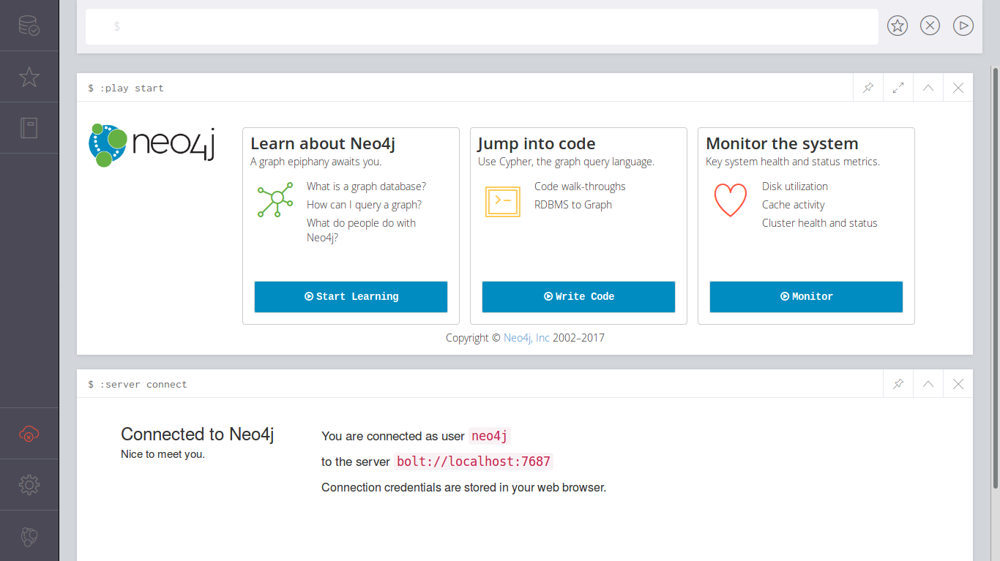

Сейчас нас будут интересовать два элемента интерфейса.

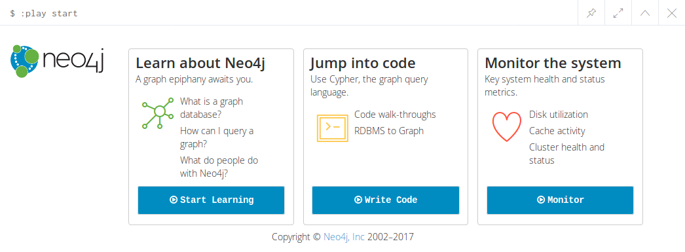

## Учебник

Neo4j предоставляет великолепный интерактивный учебник для начинающих. Очень
рекомендую его пройти. Для этого просто щёлкните на **Start Learning** и сначала
ознакомьтесь с основными понятиями Neo4j:

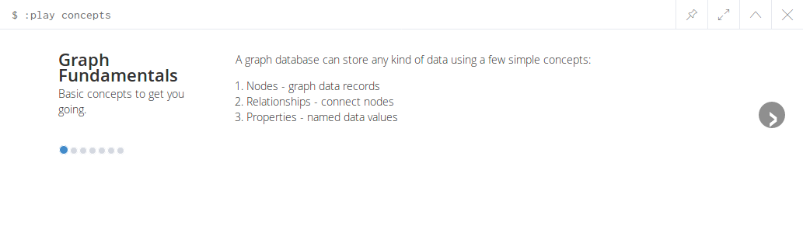

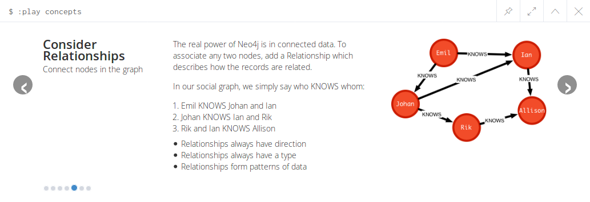

По достижению последнего шага щёлкните на **Intro** и ознакомьтесь с
возможностями Neo4j Browser:

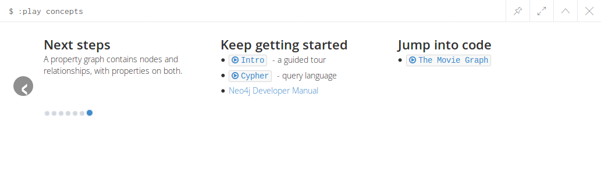

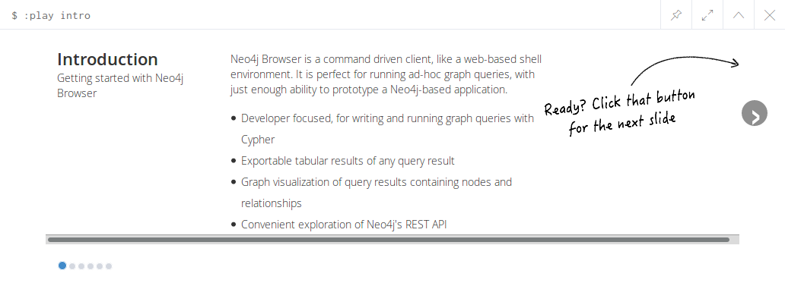

## Редактор

В верхней части окна Neo4j Browser располагается строка так называемого
редактора:


Начиная набор команд с двоеточия увидим список всех доступных команд с кратким
описанием:

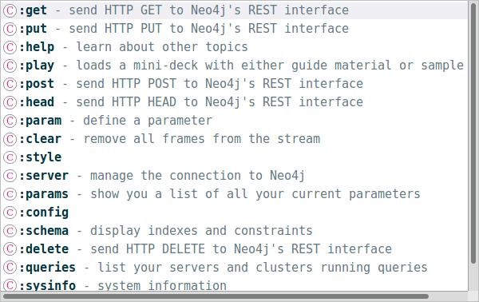

Вызовем команду `:help`:


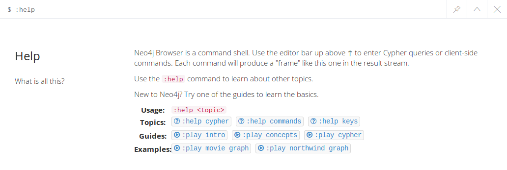

Чтобы ознакомиться с примерами работы с графами можно выбрать
`:play movie graph` или `:play northwind graph`.

Мы не будем здесь рассматривать эти примеры, а рассмотрим как создать свой
граф с помощью языка _Cypher_.

## Создаём граф

Для начала можно ознакомиться с языком Cypher, вызвав команду:

``` neo4j
:play cypher
```

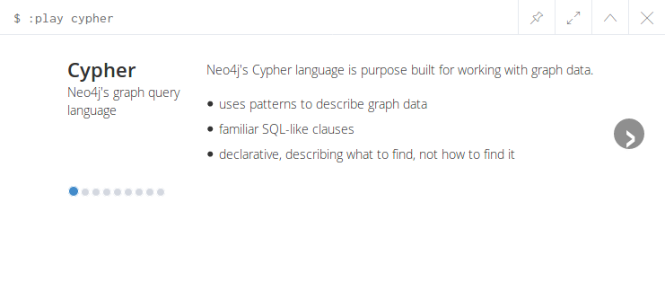

Итак, начнём. Создадим небольшой социальный граф. Перейдём в редактор и наберём
первую команду на языке Cypher:

``` cypher
CREATE (u1:Person {name: "Evgeny", from: "Krasnodar"})
```

После выполнения команды Browser сообщит нам результат:

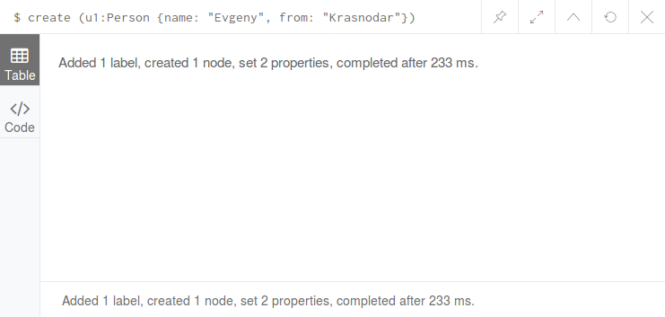

Добавим ещё один узел:

``` cypher
CREATE (u2:Person {name: "Dmitry", from: "Tula"})
```

Теперь запросим все узлы типа `Person` и извлечём значения свойства `name`:

``` cypher
MATCH (ee:Person) RETURN ee.name
```

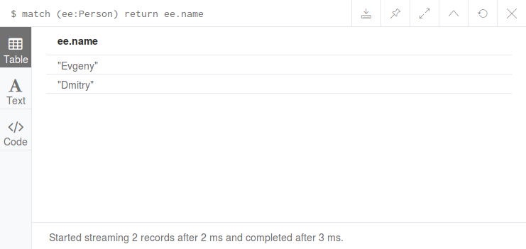

_Примечание._ Как и в SQL есть возможность упорядочить извлекаемые данные по какому-либо полю:

``` cypher
MATCH (ee:Person) RETURN ee.name ORDER BY ee.name
```

Далее можем запросить все узлы данного типа:

``` cypher
MATCH (ee:Person) RETURN ee
```

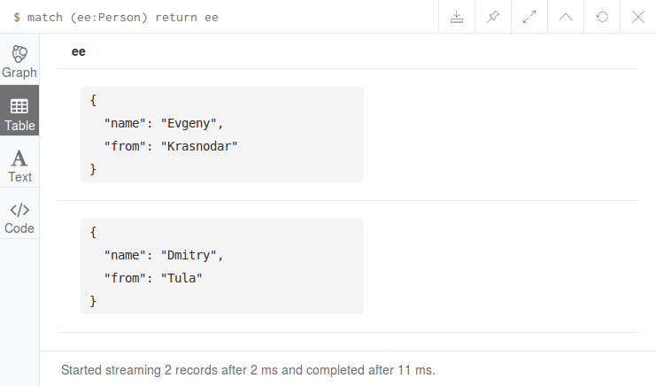

Обратите внимание на появившуюся кнопку **Graph**. Щёлкним на ней и увидим наши
узлы в графическом виде:

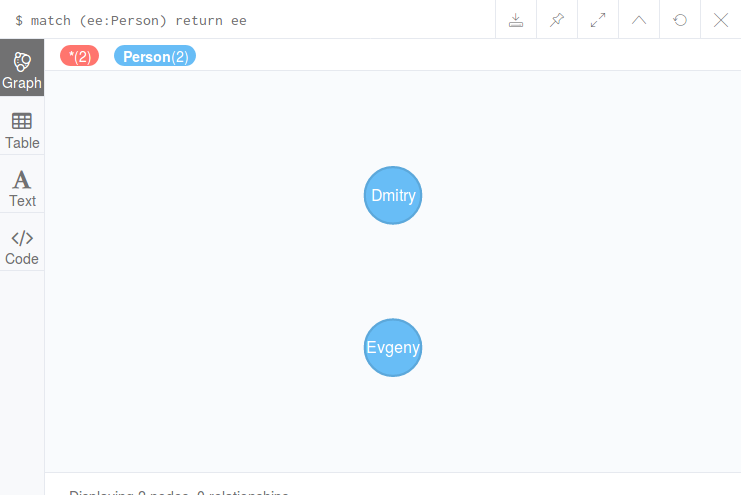

_Примечание._ В версии 3.4 по-умолчанию как-раз открывается графическое представление. Для получения 
табличного представления нужно щёлкнуть на кнопку с надписью "Table". Хотя, бывает и наоборот.

Добавим связь между узлами:

``` cypher
MATCH (e:Person) WHERE e.name = "Evgeny"
MATCH (d:Person) WHERE d.name = "Dmitry"
CREATE (e)-[:KNOWS]->(d),
  (d)-[:KNOWS]->(e)
```

И вновь запросим наш граф:

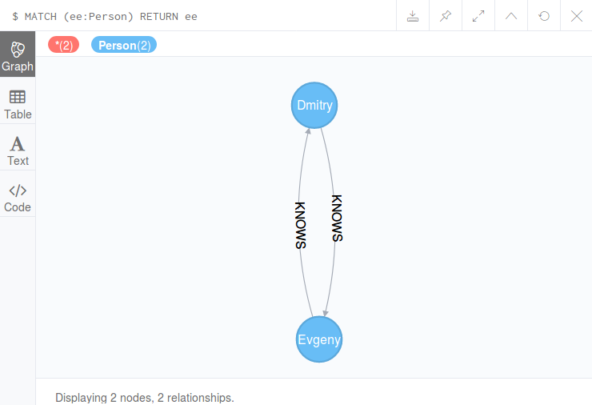

С помощью Cypher можно также выполнять различные операции над графами, например,
запрашивать смежные вершины, друзей друзей в социальном графе, удалять рёбра и
вершины и многое другое, но это тема для отдельного разговора.

## Ссылки

- [Neo4j Browser User Interface Guide](https://neo4j.com/developer/guide-neo4j-browser/)
- [The Neo4j Developer Manual v3.4](https://neo4j.com/docs/developer-manual/3.4/)
- [The Neo4j Developer Manual v3.3](https://neo4j.com/docs/developer-manual/3.3/)
- [Neo4j Graph Database Sandbox](https://neo4j.com/sandbox-v2/)
- [Neo4j GraphGists](https://neo4j.com/graphgists/)

---

(c) Симоненко Евгений, 2018
