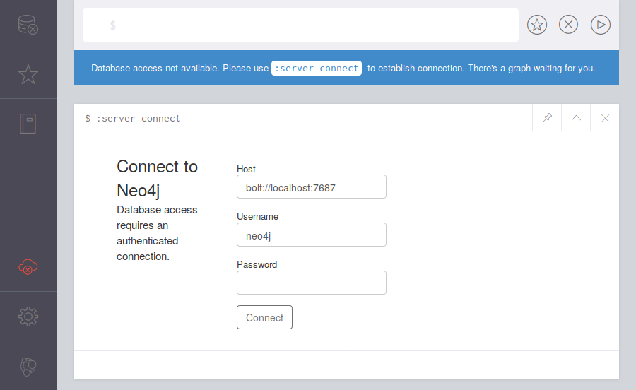
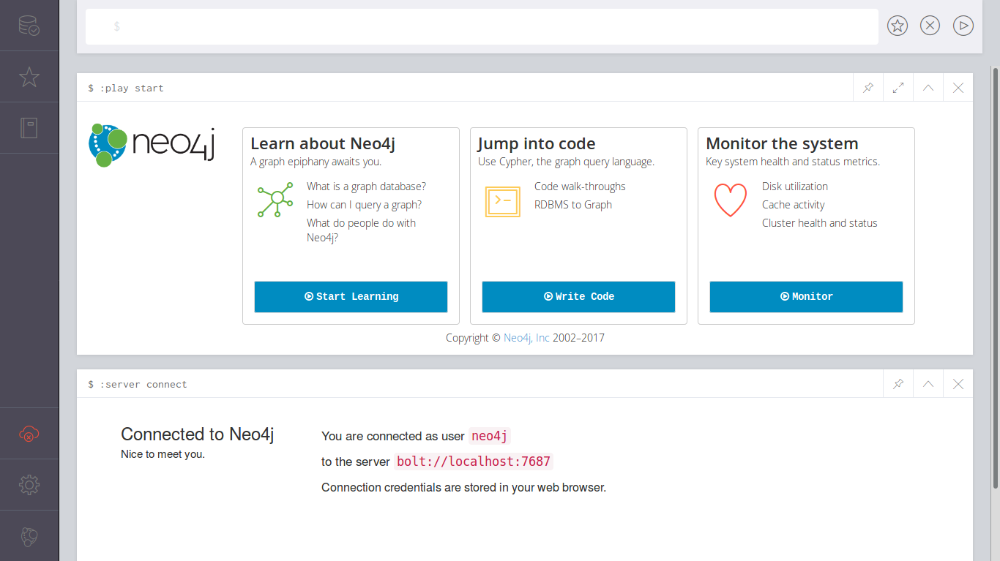

# Установка и запуск Neo4j

В статье рассматривается как установить графовую СУБД Neo4j в среде
Ubuntu Linux 16.04 LTS, 18.04 LTS, 22.04 LTS. Часть информации также будет
актуальна и для других вариантов Linux. Рассматриваемые версии Neo4j:
3.3.2 (в среде 16.04), 3.4.0 (в среде 18.04), 4.2.2 (в среде 18.04)
5.1.0 (в среде 22.04).

## Установка

Официальные инструкции по установке Neo4j в Debian и в Ubuntu
[здесь](http://debian.neo4j.com/) и
[здесь](http://neo4j.com/docs/operations-manual/current/installation/linux/debian/).
Инструкции по установке в другие операционные системы можно найти
[здесь](https://neo4j.com/download/other-releases/).

Как обычно в Debian и в Ubuntu установка сводится к добавлению ключа,
добавлению источника пакетов, обновлению локального кэша и собственно установке
пакета:

``` sh
wget -O - https://debian.neo4j.org/neotechnology.gpg.key | sudo apt-key add -
echo 'deb https://debian.neo4j.org/repo stable/' | sudo tee /etc/apt/sources.list.d/neo4j.list
sudo apt update
```

Neo4j поставлется в двух вариантах: Community и Enterprise, соответственно:

``` sh
sudo apt install neo4j
```

или

``` sh
sudo apt install neo4j-enterprise
```

Помимо `neo4j` будут установлены пакеты `cypher-shell` и `daemon`. Установка
займёт на диске порядка 100Мб.

В Ubuntu 18.04 LTS для версий 3.x потребуется также установить JDK 8
и произвести соответствующую настройку (так как основной JDK является 11,
а Neo4j этих версий работает только в JDK 8):

``` sh
sudo apt install openjdk-8-jre
```

Затем откройте настройку сервиса Neo4j для редактирования:

``` sh
sudo systemctl edit neo4j
```

И добавьте следующие строки:

``` ini
[Service]
Environment="NEO4J_CONF=/etc/neo4j" "NEO4J_HOME=/var/lib/neo4j" "JAVA_HOME=/usr/lib/jvm/java-8-openjdk-amd64"
```

Убедитесь, что настройки успешно сохранены:

``` sh
systemctl cat neo4j
```

Для версий 4.x напротив требуется JDK 11.

В Ubuntu 22.04 LTS для версий 5.x аналогично, но требуемая версия JDK 17:

``` sh
sudo apt install openjdk-17-jre
```
``` sh
sudo systemctl edit neo4j
```
``` ini
[Service]
Environment="JAVA_HOME=/usr/lib/jvm/java-17-openjdk-amd64"
```

## Запуск

Запуск в Ubuntu:

``` sh
sudo systemctl enable neo4j
sudo systemctl start neo4j
```

Проверка:

``` sh
systemctl status neo4j
http http://localhost:7474
```

``` http
HTTP/1.1 200 OK
Access-Control-Allow-Origin: *
Content-Length: 136
Content-Type: application/json; charset=UTF-8
Date: Fri, 19 Jan 2018 20:40:53 GMT
Server: Jetty(9.2.22.v20170606)

{
    "bolt": "bolt://localhost:7687", 
    "data": "http://localhost:7474/db/data/", 
    "management": "http://localhost:7474/db/manage/"
}
```

Версия 5.x отдаёт немного другую информацию:

``` http
HTTP/1.1 200 OK
Access-Control-Allow-Origin: *
Content-Length: 216
Content-Type: application/json
Date: Mon, 31 Oct 2022 12:56:48 GMT
Vary: Accept

{
    "bolt_direct": "bolt://localhost:7687",
    "bolt_routing": "neo4j://localhost:7687",
    "neo4j_edition": "community",
    "neo4j_version": "5.1.0",
    "transaction": "http://localhost:7474/db/{databaseName}/tx"
}
```

_Примечание._ `http` это утилита аналогичная `curl`, но с улучшенным
пользовательским интерфейсом. В Ubuntu 18.04 LTS её можно установить из
стандартного репозитория APT или из [PyPI](https://pypi.org/),
а в более ранних версиях через `pip` (PyPI).

``` sh
sudo apt install httpie
```

~~Если попытаться перейти по ссылке из поля `management`, ввести имя пользователя `neo4j`
и пароль `neo4j`, то получим отказ с формулировкой
`"User is required to change their password."`.~~

Если попытаться открыть веб-интерфейс Neo4j Browser, то система запросит у нас пароль.
Чтобы установить пароль, нужно запустить консольную оболочку `cypher-shell` и ввести
новый пароль:

``` sh
cypher-shell
```

``` plain
username: neo4j
password: *****
Password change required
new password:
confirm password:
Connected to Neo4j 3.3.1 at bolt://localhost:7687 as user neo4j.
Type :help for a list of available commands or :exit to exit the shell.
Note that Cypher queries must end with a semicolon.
neo4j>
```

_Примечание._ В Ubuntu 18.04 LTS для версий 3.x перед вызовом `cypher-shell`
потребуется задать `JAVA_HOME`:

``` sh
JAVA_HOME=/usr/lib/jvm/java-8-openjdk-amd64 cypher-shell
```

_Примечание._ Если JDK 11 в среде Ubuntu 18.04 LTS не используется,
то можно задать `JAVA_HOME` в `.profile`.

_Примечание._ Другой способ задать нужную версию Java:

``` shell
update-java-alternatives --list
sudo update-java-alternatives --jre --set /usr/lib/jvm/java-1.17.0-openjdk-amd64
```

Задание пароля пользователя (пропускаем, если уже сделано):

``` sh
sudo neo4j-admin set-initial-password h6u4%kr
```

Если получили сообщение об ошибке _"command failed: initial password was not set
because live Neo4j-users were detected."_, то нужно остановить сервис Neo4j:

``` sh
sudo systemctl stop neo4j
```

удалить файл `/var/lib/neo4j/data/dbms/auth`:

``` sh
sudo rm /var/lib/neo4j/data/dbms/auth
```

и повторить установку пароля, получив при этом сообщение:

``` plain
Changed password for user 'neo4j'.
```

Теперь перезапустите сервер:

``` sh
sudo systemctl restart neo4j
```

Для работы с Neo4j в браузере нужно перейти по ссылке
<http://localhost:7474/browser/>. После чего откроется великолепный
веб-интерфейс с формой подключения к базе данных:



После входа должны увидеть:



_Примечание._ Cycli больше не поддерживается, его репозиторий заархивирован.

~~Вместо `cypher-shell` можно установить альтернативный клиент
[cycli](https://github.com/nicolewhite/cycli):~~

``` sh
pip install --user cycli
```

``` sh
cycli -u neo4j
```

``` plain
Password: 
 ______     __  __     ______     __         __    
/\  ___\   /\ \_\ \   /\  ___\   /\ \       /\ \   
\ \ \____  \ \____ \  \ \ \____  \ \ \____  \ \ \  
 \ \_____\  \/\_____\  \ \_____\  \ \_____\  \ \_\ 
  \/_____/   \/_____/   \/_____/   \/_____/   \/_/ 
Cycli version: 0.7.6
Neo4j version: 3.3.1
Bug reports: https://github.com/nicolewhite/cycli/issues

> quit
Goodbye!
```

## Миграция с версии 3.5 на 4.x

- В Ubuntu Linux для обновления сервера нужно переустановить источник пакетов.
  На страничке [репозитория APT](http://debian.neo4j.com) для установки
  свежей версии есть только один вариант ссылок с указанием версии `latest`.
  Это скорее всего не лучший вариант и вместо него стоит вписать конкретную
  версию, чтобы дальнейшие обновления происходили только в рамках неё. Например:

  ```
  https://debian.neo4j.com stable latest
  https://debian.neo4j.com stable 4.2
  ```

- После чего обновить информацию о пакетах и установить новую версию Neo4j.

- Вы не сможете сразу начать работать с новой версией и потребуется провести
  дополнительные манипуляции, которые описаны на страничке официальной
  документации в разделе
  [Upgrade a single instance](https://neo4j.com/docs/operations-manual/current/upgrade/deployment-upgrading/)

- После миграции мы получаем новые возможности версии 4.x, например,
  возможность работы с разными базами данных.

## Миграция с версии 4.x на 5.x

Если до установки версии 5.x уже была установлена более ранняя версия,
то сервер Neo4j не запуститься, так как формат файлов базы данных изменился.
Для успешного запуска придётся отказаться от старой базы, переименовав, переместив
или удалив каталов `/var/lib/neo4j/data`.

## Что почитать

Кроме собственно документации на сайте Neo4j есть пара книг на русском языке:

- Робинсон Ян, Вебер Джим, Эифрем Эмиль. Графовые базы данных. Новые
  возможности для работы со связанными данными. -- 2016. -- 256 с.
- Редмонд Эрик, Уилсон Джим Р. Семь баз данных за семь недель. Введение в
  современные базы данных и идеологию NoSQL. -- 2015. -- 384 с.

Интересные статьи на русском языке:

- [Изучаем граф-ориентированную СУБД Neo4j на примере лексической базы Wordnet](https://habrahabr.ru/post/273241/)
- [Начинаем работать с графовой базой данных Neo4j (фильтр товаров)](https://habrahabr.ru/post/219441/)

## Ссылки

- [Сайт Neo4j](https://neo4j.com/)
- [Neo4j на GitHub](https://github.com/neo4j/neo4j)
- [Загрузка различных выпусков Neo4j](https://neo4j.com/download/other-releases/)
- [Сервер пакетов для Debian/Ubuntu](http://debian.neo4j.com/)
- [Инструкции по установке в Debian/Ubuntu](http://neo4j.com/docs/operations-manual/current/installation/linux/debian/)
- [cycli -- альтернативный клиент Cypher](https://github.com/nicolewhite/cycli)

## Обновления

### 31 октября 2022

- Добавлена информация по установке и настройке версии 5.1 в Ubuntu 22.04.

### 14 января 2021

- Добавлена информация по версии 4.x.

### 4 июня 2018

- Добавлена информация по установке и работе в Ubuntu 18.04 LTS.

---

(c) Симоненко Евгений, 2018, 2021, 2022
