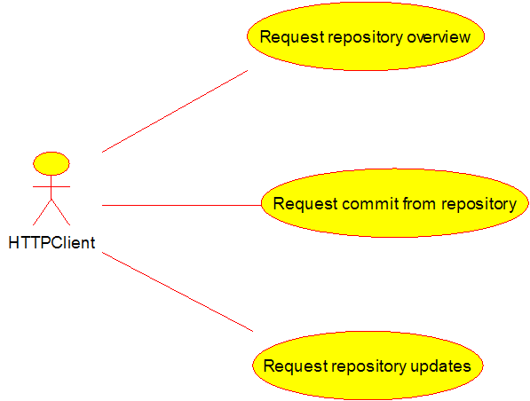
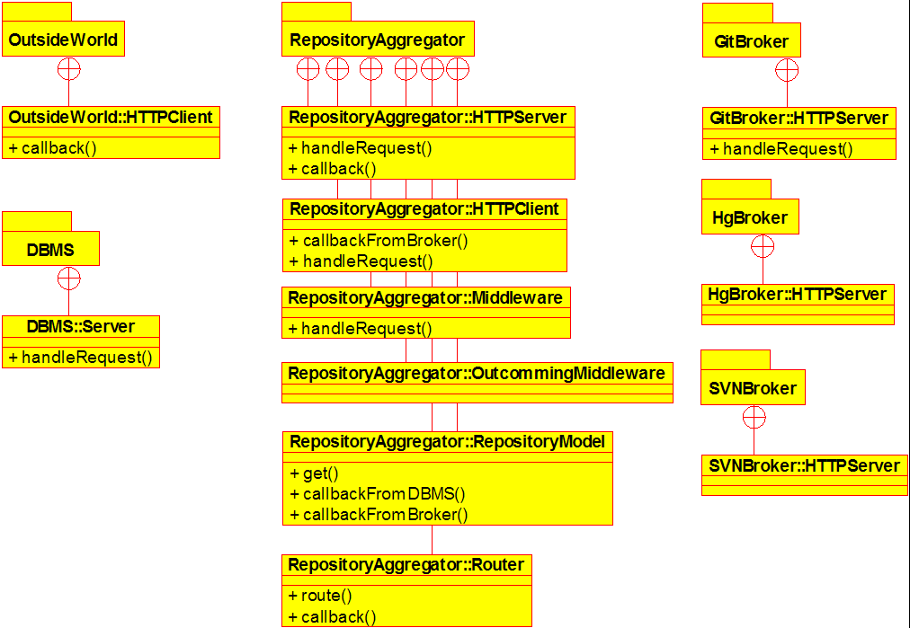
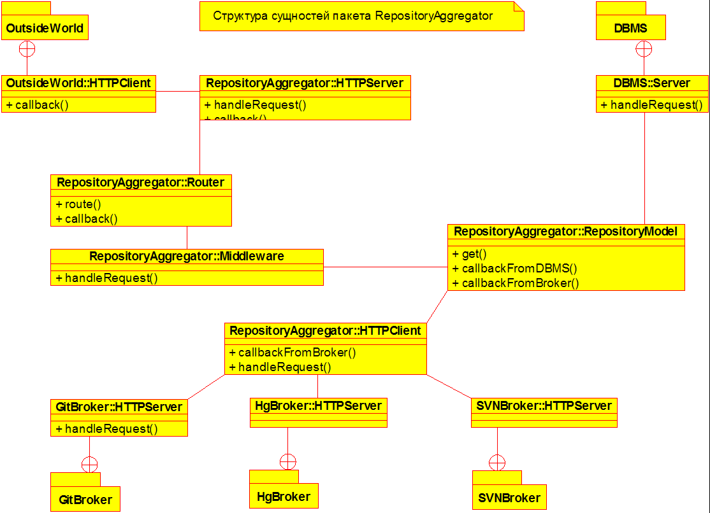
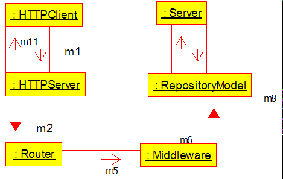
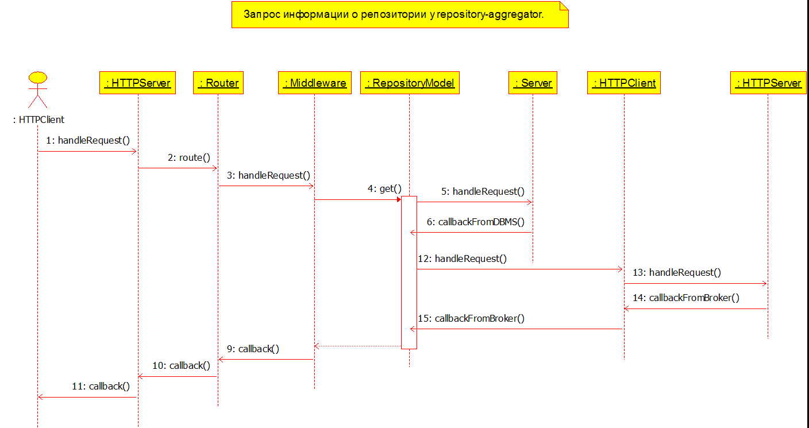
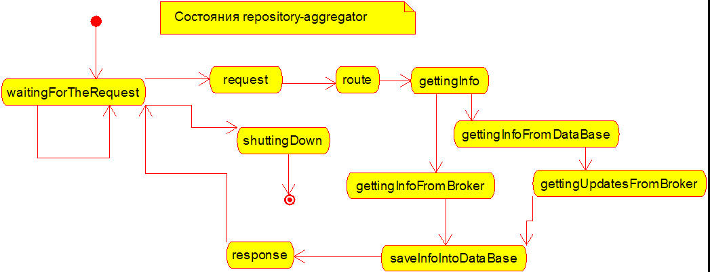
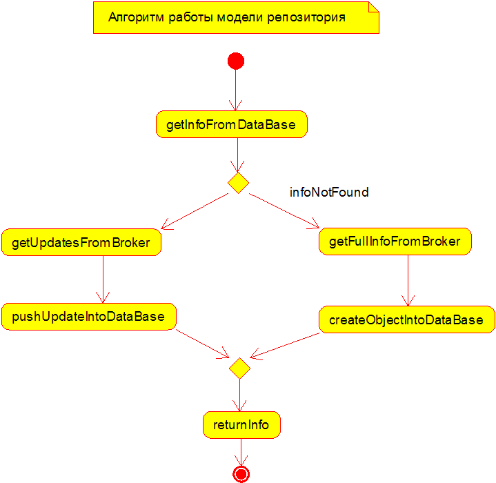

# Диаграммы UML для Repository Aggregator

Диаграмма прецедентов:

Диаграмма пакетов:

Диаграмма классов:

Диаграмма коммуникаций:

Диаграмма последовательности:

Диаграмма состояний:

Диаграмма активности:

---

(c) 2017, Симоненко Евгений
